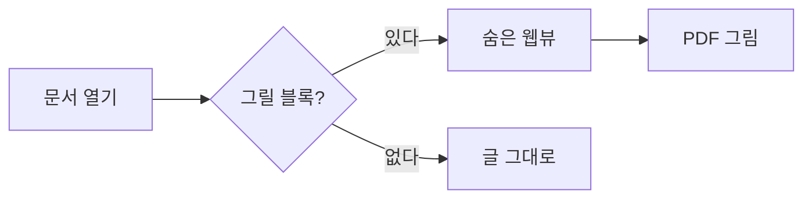

## 다이어그램과 수식

```mermaid
graph LR
  A[문서 열기] --> B{그릴 블록?}
  B -->|있다| C[숨은 웹뷰]
  B -->|없다| D[글 그대로]
  C --> E[PDF 그림]
```

가우스 적분은 이렇다.

$$
\int_{-\infty}^{\infty} e^{-x^2}\,dx = \sqrt{\pi}
$$

캐럿을 블록 안에 두면 원문이 보인다.
